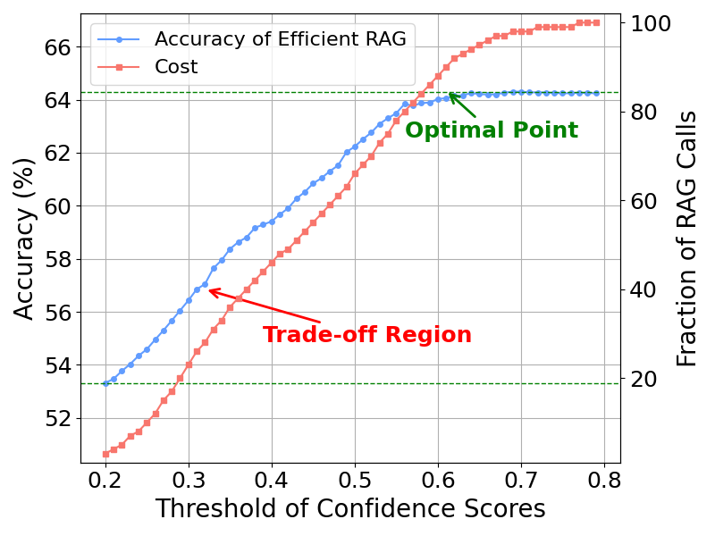

# query_level_uncertainty
[](https://pypi.org/project/query-level-uncertainty/)
[](https://arxiv.org/abs/2506.09669)
[](https://opensource.org/licenses/MIT)

This is the repo for our work "Query-Level Uncertainty in Large Language Models". Our proposed **Internal Confidence** is much faster than answer-level approaches (left figure). More importantly, it can be applied to adaptive inference, e.g., RAG, Deep Thinking, Cascading, and Abstention (right figure).

<p float="left">
  
  
</p>

## Internal Confidence
The benefits of using our proposed internal confidence
* Training-free. No requirements for training samples.
* Fast. Estimating uncertainty using only a single forward pass of a given query without generating any tokens.

## Usage
Install our query-level uncertainty
```python
pip install query-level-uncertainty
```
Choose an uncertainty method to use
```python
from transformers import AutoModelForCausalLM, AutoTokenizer
import torch
from ql_uncertainty import QLUncertainty

model_name = 'meta-llama/Llama-3.1-8B-Instruct'
model = AutoModelForCausalLM.from_pretrained(
                model_name,
                low_cpu_mem_usage=True,
                torch_dtype=torch.float16,
                device_map="cuda:0"
            )
tokenizer = AutoTokenizer.from_pretrained(model_name)
tokenizer.pad_token = tokenizer.eos_token
model.eval()

query = "what is the capital of France"


# max probability
ql_uncertainty = QLUncertainty(model, tokenizer, method='max_prob')
score = ql_uncertainty.estimate(query)
print(f"[max_prob] score = {score}")

# predictive entropy
ql_uncertainty = QLUncertainty(model, tokenizer, method='pd_entropy')
score = ql_uncertainty.estimate(query)
print(f"[pd_entropy] score = {score}")

# Min-K Entropy
ql_uncertainty = QLUncertainty(model, tokenizer, method='mink_entropy')
score = ql_uncertainty.estimate(query)
print(f"[mink_entropy] score = {score}")


# Attentional Entropy 
ql_uncertainty = QLUncertainty(model, tokenizer, method='attn_entropy')
score = ql_uncertainty.estimate(query)
print(f"[attn_entropy] score = {score}")


# Perplexity 
ql_uncertainty = QLUncertainty(model, tokenizer, method='ppl')
score = ql_uncertainty.estimate(query)
print(f"[ppl] score = {score}")

# internal confidence. It is necessary to have token ids for Yes (7566) and No (2360). Repalce target tokens when using different LLMs
ql_uncertainty = QLUncertainty(model, tokenizer, method='internal_confidence', target_tokens=[[7566], [2360]])
score = ql_uncertainty.estimate(query)
print(f"[internal_confidence] score = {score}")


# internal confidence with in-context learning
ql_uncertainty = QLUncertainty(model, tokenizer, method='internal_confidence', target_tokens=[[7566], [2360]])
examples = [{'query':'the capital of China is Beijing', 'answer': 'Yes' }, {'query':'the capital of Spain is London', 'answer': 'No'}]
score = ql_uncertainty.estimate(query, examples)
print(f"[internal_confidence with examples] score = {score}")
```


## Adaptive Inference
In terms of applications, we showcase that our proposed method can help efficient RAG and model cascading. 
On the one hand, internal confidence can guide users to assess the trade-offs between cost and quality when invoking additional services. On the other hand, it brings an ``optimal point'', where inference overhead can be reduced without compromising performance.

<p float="left">
  
  
</p>

## Citation
If you find our work useful, give us a star or citation. Thank you!

